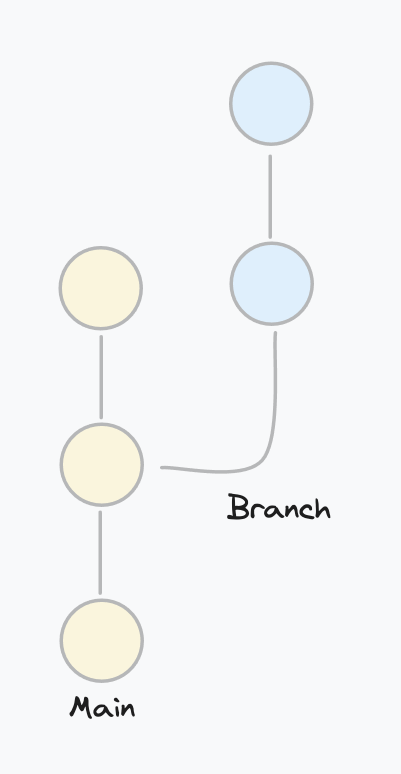
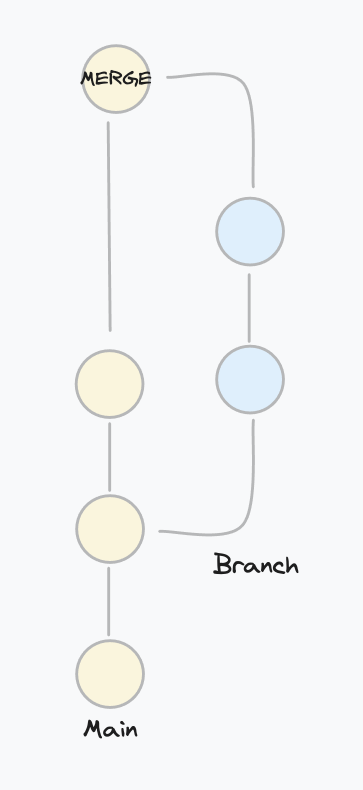

### Outline/TODO

- [x] What is Git
- [x] Key Terms
    - [x] Repository
    - [x] Commit
    - [x] Branch
    - [x] Working Directory
    - [x] Staging Area
    - [ ] HEAD
- [x] Commands
    - [x] git config
    - [x] git init
    - [x] git clone
    - [x] git checkout
    - [x] git branch
    - [x] git add
    - [x] git status
    - [x] git commit
    - [x] git remote
    - [x] git push
    - [x] git log
    - [x] git fetch
    - [x] git merge
    - [x] git pull
    - [x] git rebase
- [ ] Workflows

# What is Git
Git is a free and open-source version control system created by Linus Torvalds. It tracks and manages changes in your code and makes it easier to collaborate on projects with others. Git allows users to see who made what changes when and easily revert to older snapshots of a project. We use it to avoid having to store multiple versions of files. Git handles everything in an effecient way. 

# Key Terms
### **Repository (AKA repo)** 
A folder where are the files being tracket by git are located. It's also where the `.git` folder is located which contains all the meta data.

### **Commit** 
A commit is when you take a snapshot of changes made to your repository. Commits are logged and and used to track and manage the history of your repository.

### **Branch**
A branch is an offshoot from the main line of development. It's like a safe zone where you can commit changes without affecting the main line. This is especially useful when working with others because you can experiment and make changes without interfering with code others are working on. When you are done making changes you can merge your changes into the main line of development.

Left,visualization of branching. Right, visualization of merging the branch.

### **Working Directory**
The working directory is your project folder. Your .git folder and any other files in your project are stored there.

### **Staging Area**
The staging area is where you put changes that are ready to [commit](#commit).

### **HEAD**
HEAD is a reference that points to the latest [commit](#commit) of a branch.

# Commands

### git config
`git config` is used to set your repository's configuration values. You can set config values either locally or globally. Local settings only affects the current repository you are working on. Global settings apply on all git repos. Local settings overwrite global settings. The most common usage is setting your name and email.

This command sets your global email

`git config --global user.name your.email@service.com`

and this one sets your global name

`git config --global user.name yourName`

This is so people know who made what changes. Without a name and email you will not be able to apply changes.

To list your config settings (located in `.git/config` in your repo folder) run `git config --list`.

---
### git init

All `git init` does is initialize your github repository. If you run `git init` in a folder it adds a .git folder which includes all of the meta data needed to start using git for your files.

---
### git clone

`git clone URL` copies a remote repository and all of it's history onto your computer. Git supports https, git, and ssh protocols for the URL.

### git checkout
`git checkout branchName` switches you to the branch you specify.

`git checkout -b branchName` creates the branch given and then switches you to it.

---
### git branch

`git branch` lists all of your branches in your repo.

`git branch branchName` creates a branch but doesn't switch you to it.

`git branch -d branchName` deletes specified branch.

`git branch -a` lists remote branches.

---
### git add

`git add filePath` moves all of your changes from the specified file/folder into the [staging area](#staging-area). 

---
### git status

`git status` shows which files are in the staging area and which files are in your [working directory](#working-directory).

---
### git commit

`git commit` records or takes a snapshot of your staged changes. 

`git commit -m "your message"`. The -m flag lets you add a message to your snapshot.

`git commit -a` commits all changes in your [working directory](#working-directory) even if they aren't staged.

`git commit --amend` adds your staged changes on top of your last snapshot. This command doesn't create a new snapshot, it edits the last one.

---
### git remote

This command lets you view and manage your remote repository connections

`git remote` will list your connections

`git remote -v` will list your connections with urls

`git remote add nameOfRemote url` will create a new connection to the given url, with the given name.

---
### git push

`git push remoteName localBranch` updates your remote repository to match your local repository.

We can use the `-u` flag to make git remember our connection with origin.

`git push -u remoteName localBranch`

Now when we push our changes in the future we can simply run `git push`

---
### git log

`git log` will list details of all of the repository's snapshots.

---
### git fetch

`git fetch remoteName` updates your remote tracking branches which are references to the remote branches you are connected to. This means that any changes from the remote repository are brought into your local repository but not into your working directory.

`git fetch remoteName remoteBranchName` only fetches from the specified remote branch.

---
### git merge

`git merge remoteName/remoteBranchName` will bring those fetched changes into your working directory. 

`git merge localBranchName` will merge your commits from the branch you specify on top of the [HEAD]() of the current branch you are on. It will apply the changes to your working directory.

---
### git pull

`git pull` runs [`git fetch`](#git-fetch) and then [`git merge`](#git-merge).

---
### git rebase

`git rebase branchName` will change the base of your current branch to the [HEAD]() of the specified branch. It is important to keep in mind that when this happens the commits from your current branch are replaced with new commits. These new commits share the same content of the deleted ones but have a different ids.

This command is helpful because it keeps your history clear and linear.

# Workflows

